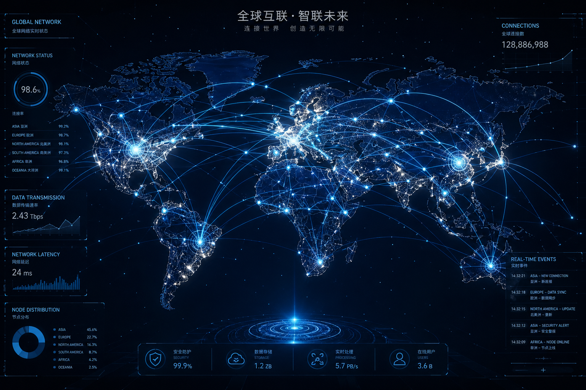
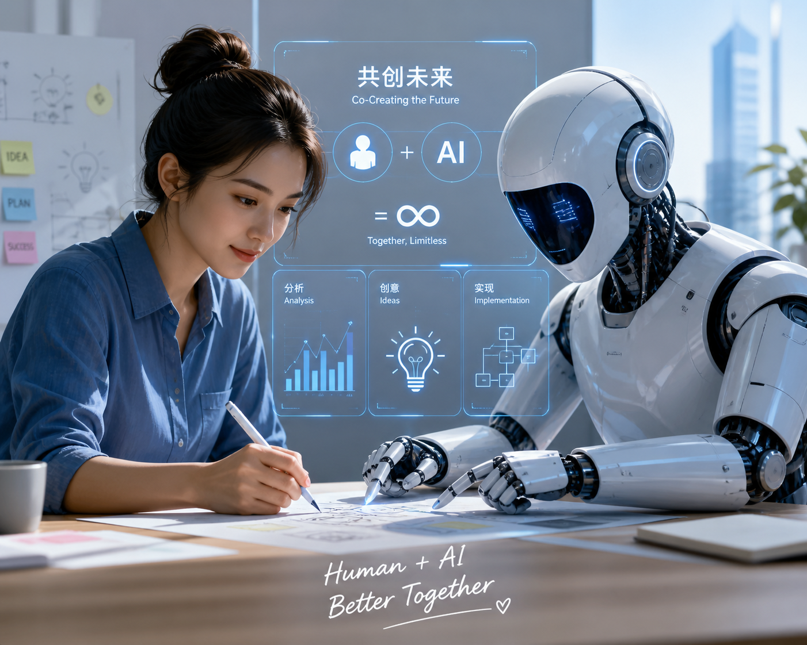

# 🧠 硅基启蒙：AI 时代的全球重构

> **"Reborn with AI, defined by lifelong learning."** —— 站在 2026 年的节点，我们正目睹一场关于生产力与存在意义的彻底重塑。

---

### 🚀 奇点临近：从工具到智慧的跃迁

AI 不再只是冷冰冰的算法，它正在全球范围内引发**“智能涌现”**：

*   **重构生产关系**：AI 正在抹平全球的信息差，让一个偏远地区的开发者也能通过 Prompt 调动顶级生产力。
*   **知识的民主化**：AI 打破了专业知识的壁垒。复杂的科学、艺术与技术不再是少数精英的专利，而是每个人都能随手调用的“大脑插件”。
*   **从碳基到硅基**：如果说工业革命延伸了人类的手脚，那么 AI 则是在尝试外挂人类的大脑，实现人类智慧的第二次指数级扩张。

---

### 🌐 数字化生存：在确定性中寻找可能

AI 的本质是对世界进行**概率建模**。

*   **理解与生成**：它通过万亿级的参数去拟合人类的逻辑，让原本复杂、非线性的世界运行规律变得有迹可循。
*   **认知的军备竞赛**：在未来的全球格局中，获取信息的能力不再重要，**提问的能力**（The Art of Asking）与**逻辑归纳能力**才是核心。

---

### 💡 终身学习者的使命

在 AI 定义的时代，我始终坚信：**“重新出生”不仅是拥抱技术，更是保持对世界的好奇。**

*   **底层逻辑解构**：无论是优化零售门店的数字闭环，还是分析复杂系统的运作逻辑，本质都是在用 AI 思维去拆解、重组并解决问题。
*   **定义未来**：AI 负责提供效率，而人类负责赋予意义。在算法的海洋里，我们的直觉与同理心是唯一的灯塔。

---
*Last updated: May 2026*
