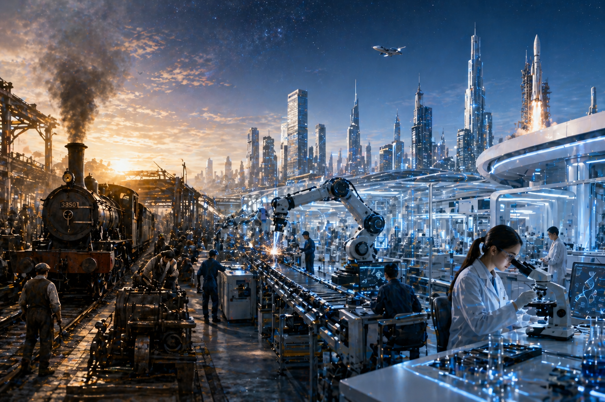

# 💰 投资第一课：财富的源头与本质

> "太多人把投资理财看作一个抽象的数字游戏，却忘记了钱必须投向真实的财富创造过程。"

---

### 1. 钱从哪里来？
大家都在忙着赚钱，社会上的钱也越来越多，那整个社会“多出来的钱”到底是从哪里的？

财富的增长并非魔法，而是由**三个核心要素**驱动的：
*   **自然资源**：地球赋予的原始生产资料。
*   **劳动**：人类体力的投入。
*   **技术**：人类智慧对生产效率的改进。

**逻辑模型：**
人类把石头磨成斧头（技术），去森林砍树（劳动+资源），得到了更多的木头（总产量提高）。人类通过改进技术、投入劳动，不断提高社会总产量，这是财富增长的终极动力。

---

### 2. 组织的进化：现代公司与资本
在现代社会，财富很大一部分是以**公司**为单位创造的。
*   **现代公司制度**：将资源、劳动和技术高效组织在一起的容器。
*   **现代资本市场**：为这个容器提供养分的血液循环系统。

---

### 3. 投资的本质：把钱扔进真实的组织
投资绝不是屏幕上波动的红色或绿色数字，它是一个非常具体的动作：

> **投资就是我们将闲置的资本，投入到一个真实的、希望用这笔钱创造更多财富的组织里。**

如果你忘记了这一点，投资就会变成赌博。

---

### 4. 穿透表象：回归常识与公理
无论金融产品名字换成什么，无论技术包装得多么深奥，作为投资者，必须死磕这三个问题：

1.  **底层资产是什么？** 你的钱到底买到了什么？
2.  **钱去哪了？** 是在实验室研发技术，还是在工厂生产产品？
3.  **回报的来源是什么？** 它是否满足这个世界最基本的**常识与公理**？

---
### 💡 结语
如果不了解回报来源，就不要轻易出手。真正的投资，是看清财富流转的路径，并选择站在能创造真实价值的一方。

---
*Last updated: May 2026*
