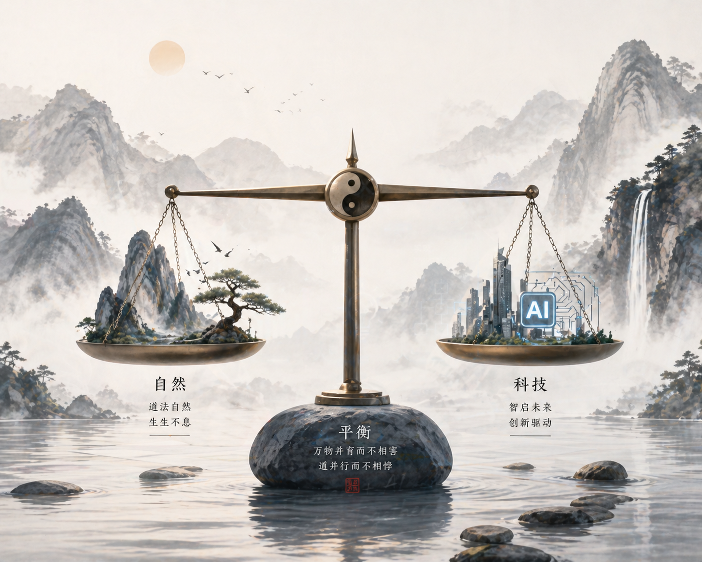

# ⚖️ 投资之道：于无声处听惊雷

> "天地不仁，以万物为刍狗；投资无情，以规律为准绳。"

---

### 🌀 均值回归：市场的“天道”

在宏观经济与个人投资中，最强大的力量不是增长，而是**回归**。
*   **盈亏同源**：你靠运气赚到的钱，往往会靠实力亏掉。理解“术”的边界，才能守住“道”的果实。
*   **周期的宿命**：万物皆有周期，繁荣背后潜伏着萧条，阴极必阳。在投资中，比寻找机会更重要的，是学会在周期中等待。

---

### 🛡️ 认知偏差：人性的“心魔”

投资不是人与人的博弈，而是**人与自己本能的博弈**。
*   **知行合一**：买入卖出可能只需要一瞬间，但要在极端行情下按兵不动，需要一生的修行。
*   **反直觉思考**：大众恐惧时贪婪，大众贪婪时恐惧。这不仅是策略，更是对人性弱点的逆向利用。

---

### 💎 财富的本质：认知的变现

你投资所赚到的每一分钱，都是你认知变现的结果。
*   **解构底层逻辑**：正如分析一个系统的代码结构，投资需要我们剥离表象的波动，看清价值交换的本质。
*   **长期主义**：在充满随机性的市场里，唯一能对抗不确定性的，就是选择站在概率的一方，并给时间以耐心。

---

### 🕯️ 守弱与不争

*   **避开拥挤**：最好的机会往往不在聚光灯下。
*   **容错空间**：永远不要把自己置于“必须赢”的悬崖边缘，留足安全边际，才是长存之道。

---
*Last updated: May 2026*
